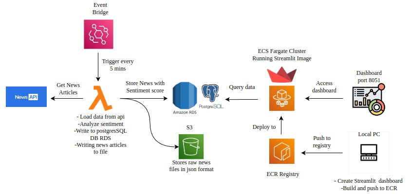

# **🚀News Sentiment Analysis Pipeline**

A cloud-native pipeline to fetch real-time news, analyze sentiment using TESTBLOB, store it in PostgreSQL (RDS), and visualize insights via a Streamlit dashboard hosted on ECS Fargate.

### 🧱  **Architecture**

### 🛠️**Tech Stack**

- **⚡AWS Lambda** – News fetching & sentiment scoring  
- **🐘Amazon RDS** – PostgreSQL for structured sentiment storage  
- **🪣Amazon S3** – Store raw JSON files  
- **🚢Amazon ECS Fargate** – Hosts the Streamlit dashboard  
- **⏰Amazon EventBridge** – Triggers Lambda every 5 minutes  
- **📊Streamlit** – Dashboard to display sentiment trends  
- **🐳Docker + 🧰ECR** – For containerized dashboard deployment

### **✨Features**

- 🔄Automated news fetching from News API
- 📈Real-time sentiment analysis 
- 🧾Raw and structured storage using S3 & RDS  
- 🖥️Dockerized Streamlit dashboard  
- 💸Serverless and cost-effective architecture

## **📖Overview**

This project is an end-to-end cloud-based pipeline that automates the collection, analysis, and visualization of news sentiment using a fully serverless and containerized architecture on AWS. It fetches real-time news articles from an external API every 5 minutes using Amazon EventBridge to trigger an AWS Lambda function. The Lambda function stores raw news data in Amazon S3 and inserts it into Amazon RDS (PostgreSQL). Sentiment analysis is performed locally using TextBlob, and the results are visualized through a Streamlit dashboard. The dashboard is containerized, pushed to Amazon ECR, and deployed via Amazon ECS Fargate. This architecture enables scalable, real-time sentiment tracking of news content with minimal operational overhead.

## **📌Conclusion**
The project successfully implements an end-to-end News Sentiment Analysis Dashboard using AWS cloud services and Python-based technologies. By integrating components such as AWS Lambda, S3, RDS (PostgreSQL), and Streamlit, we were able to design a scalable, serverless pipeline for ingesting, analyzing, and visualizing real-time news sentiment.

Key achievements include:

Automated ingestion and storage of news articles using S3 and Lambda.

Real-time sentiment analysis , deployed through AWS Lambda.

Centralized data storage with Amazon RDS, enabling structured access and querying.

A user-friendly and interactive Streamlit dashboard for visualizing sentiment trends and article data.

This project demonstrates the power of combining cloud infrastructure with data science to build a production-ready pipeline that can be extended to domains like stock market insights, brand monitoring, or political news analysis.

Going forward, the project can be enhanced with:

Scheduled triggers using Amazon EventBridge

Deployment via ECS Fargate
